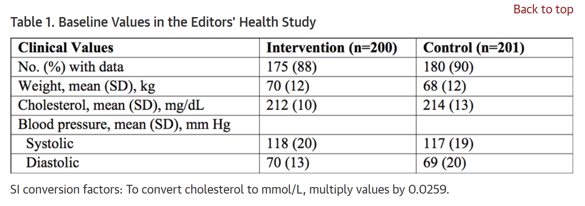
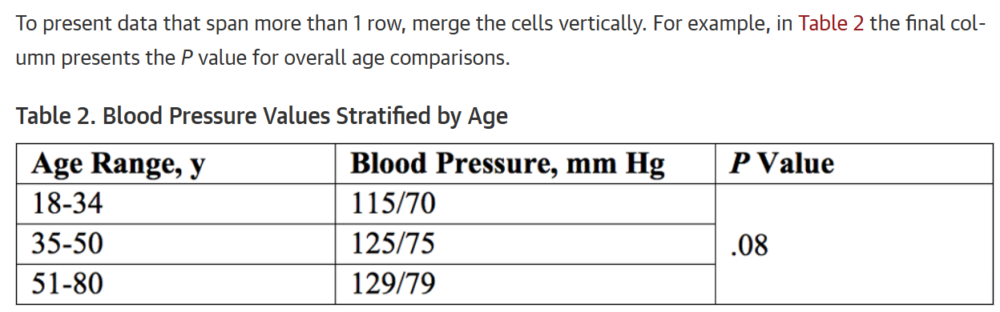
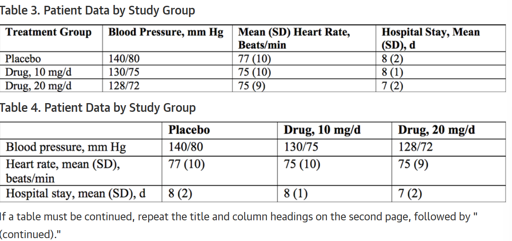
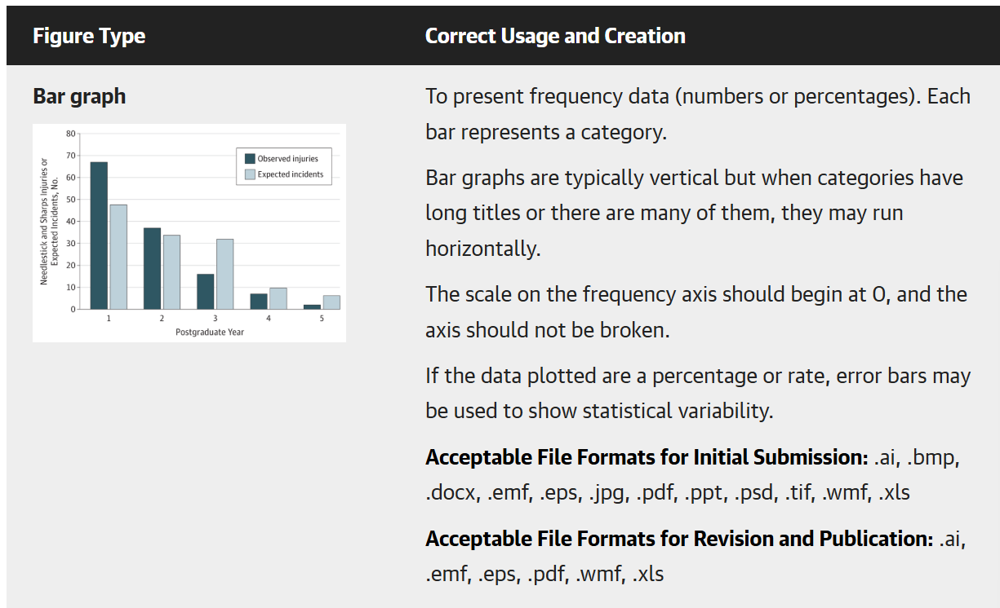
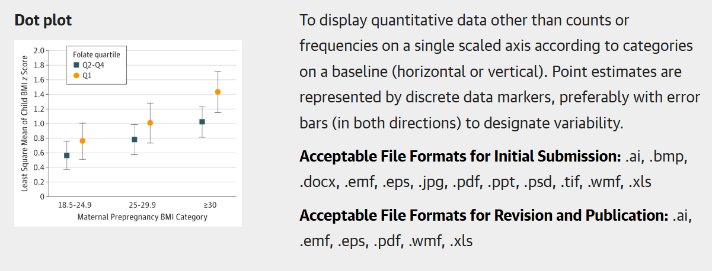

## JAMAの投稿ガイドライン

<https://jamanetwork.com/journals/jama/pages/instructions-for-authors#SecReportingStandardsandDataPresentation>

## Cohort Study

-   Description

    -   An observational study that follows a group (cohort) of individuals who are initially free of the outcome of interest. Individuals in the cohort may share some underlying characteristic, such as age, sex, diagnosis, exposure to a risk factor, or treatment.

-   Requirements

    -   3000 words

    -   ≤5 tables and/or figures

    -   50-75 references

    -   Structured abstract

    -   Key Points

    -   [Data Sharing Statement](https://jamanetwork.com/journals/jama/pages/instructions-for-authors#SecDataSharingStatement)

    -   Follow [STROBE Reporting Guidelines](https://www.equator-network.org/reporting-guidelines/strobe)

## Manuscript Submission

-   All manuscripts must be submitted online via the [online manuscript submission and review system](https://manuscripts.jama.com/).

-   At the time of submission, complete contact information (affiliation, postal/mail address, email address, and telephone numbers) for the corresponding author is required. First and last names, email addresses, and institutional affiliations of all coauthors are also required. After the manuscript is submitted, the corresponding author will receive an acknowledgment confirming receipt and a manuscript number. Authors will be able to track the status of their manuscripts via the online system. After manuscript submission, all authors of papers under consideration for publication will be sent a link to the Authorship Form to complete and submit. See other details in these instructions for additional requirements.^[2](https://jamanetwork.com/journals/jama/pages/instructions-for-authors#Ref2),[4](https://jamanetwork.com/journals/jama/pages/instructions-for-authors#Ref4)^

## Tables and Figures

-   Restrict tables and figures to those needed to explain and support the argument of the article and to report all outcomes identified in the Methods section. Number each table and figure and provide a descriptive title for each. Every table and figure should have an in-text citation. Verify that data are consistently reported across text, tables, figures, and supplementary material.

-   Frequency data should be reported as "No. (%)," not as percentages alone (exception, sample sizes exceeding \~10,000). Whenever possible, proportions and percentages should be accompanied by the actual numerator and denominator from which they were derived. This is particularly important when the sample size is less than 100. Do not use decimal places (ie, xx%, not xx.xx%) if the sample size is less than 100. Tables that include results from multivariable regression models should focus on the primary results. Provide the unadjusted and adjusted results for the primary exposure(s) or comparison(s) of interest. If a more detailed description of the model is required, consider providing the additional unadjusted and adjusted results in supplementary tables.

-   Tables have a minimum of 2 columns. Comparisons must read across the table columns.

-   Do not duplicate data in figures and tables. For all primary outcomes noted in the Methods section, exact values with measures of uncertainty should be reported in the text or in a table and in the Abstract, and not only represented graphically in figures.

-   Pie charts and 3-D graphs should not be used and should be revised to alternative graph types.

-   Bar graphs should be used to present frequency data only (ie, numbers and rates). Avoid stacked bar charts and consider alternative formats (eg, tables or splitting bar segments into side-by-side bars) except for comparisons of distributions of ordinal data.

-   Summary data (eg, means, odds ratios) should be reported using data markers for point estimates, not bars, and should include error bars indicating measures of uncertainty (eg, SDs, 95% CIs). Actual values (not log-transformed values) of relative data (for example, odds ratios, hazard ratios) should be plotted on log scales.

## Table Creation

-   Use the table menu in the software program used to prepare the text. Tables can be built de novo using Insert→Table or copied into the text file from another document (eg, Word, Excel, or a statistical spreadsheet).

-   Tables should be single-spaced and in a 10- or 12-point font (do not shrink the point size to fit the table onto the page). Do not draw extra lines or rules—the table grid will display the outlines of each cell.

-   Missing data and blank space in the table field (ie, an empty cell) may create ambiguity and should be avoided; use abbreviations such as NA for not applicable or not available. Each piece of data needs to be contained in its own cell. Do not try to align cells with hard returns or tabs; alignment will be imposed in the production system if the manuscript is accepted. To show an indent, add 2 spaces.

-   When presenting percentages, include numbers (numerator and denominator).

-   Include statistical variability where applicable (eg, mean \[SD\], median \[IQR\]). For additional detail on requirements for data presentation in tables, see [Statistical Methods and Data Presentation](https://jamanetwork.com/journals/jama/pages/instructions-for-authors#SecStatisticalMethodsandDataPresentation).

-   Place each row of data in a separate row of cells, and note that No. (%) and measures of variability are presented in the same cell as in the example [Table 1](https://jamanetwork.com/journals/jama/pages/instructions-for-authors#SecTable1) below:

## Table Footnotes

-   Footnotes to tables may apply to the entire table, portions (eg, a column), or an individual entry.

-   When both a footnote letter and reference number follow data in a table, set the superscript reference number first followed by a comma and the superscript letter.

-   Use superscript letters (a, b, c) to mark each footnote and be sure each footnote in the table has a corresponding note (and vice versa).

-   List abbreviations in the footnote section and explain any empty cells.

-   If relevant, add a footnote to explain why numbers may not sum to group totals or percentages do not add to 100%.

-   For more detail on the components and recommended structure of tables, see the [*AMA Manual of Style*](https://academic.oup.com/amamanualofstyle/book/27941/chapter/207563838#382789057).^[2](https://jamanetwork.com/journals/jama/pages/instructions-for-authors#Ref2)^

## Figures

-   For initial manuscript submissions, figures must be of sufficient quality and may be embedded at the end of the file for editorial assessment and peer review. If a revision is requested and before a manuscript is accepted, authors will be asked to provide figures that meet the requirements described in [Figure File Requirements for Publication](https://jamanetwork.com/journals/jama/pages/instructions-for-authors#SecFigureFileRequirementsforPublication).

-   See the [Table of Figure Requirements](https://jamanetwork.com/journals/jama/pages/instructions-for-authors#SecTableofFigureRequirements) for additional guidance for specific types of figures for suggested resolution and file formats. In general each figure should be no larger than 1 MB.

-   Figure Titles and Legends

    -   At the end of the manuscript, include a title for each figure. The figure title should be a brief descriptive phrase, preferably no longer than 10 to 15 words. A figure legend (caption) can be used for a brief explanation of the figure or markers if needed and expansion of abbreviations. For photomicrographs, include the type of specimen, original magnification or a scale bar, and stain in the legend. For gross pathology specimens, label any rulers with unit of measure. Digitally enhanced images must be clearly identified in the figure legends as enhanced or manipulated, eg, computed tomographic scans, magnetic resonance images, photographs, photomicrographs, x-ray films

## General Figure Guidelines

-   Primary outcome data should not be presented in figures alone. Exact values with measure of variability should be reported in the text or table as well as in the abstract.

-   All symbols, indicators (including error bars), line styles, colors, and abbreviations should be defined in a legend.

-   Each axis on a statistical graph must have a label and units of measure should be labeled.

-   Do not use pie charts, 3-D graphs, and stacked bar charts as these are not appropriate for accurate statistical presentation of data and should be revised to another figure type or converted to a table.

-   Error bars should be included in both directions, unless only 1-sided variability was calculated.

-   Values for ratio data—odds ratios, relative risks, hazard ratios—should be plotted on a log scale. Values for ratio data should not be log transformed.

-   For footnotes, use letters (a, b, c, etc) not symbols.

-   Do not submit figures with more than 4 panels unless otherwise justified.

-   See the [*AMA Manual of Style*](https://academic.oup.com/amamanualofstyle/book/27941/chapter/207563838#382789206) for more guidance on figure types and components

## Table of Figure Requirements

-   Bar graph

    

-   Dot plot

    

## Statisistical Methods and Data Presentation

-   General Considerations

    -   Authors are encouraged to consult "Reporting Statistical Information in Medical Journal Articles."^[1](https://jamanetwork.com/journals/jama/pages/instructions-for-authors#Ref1)^ In the Methods section, describe statistical methods with enough detail to enable a knowledgeable reader with access to the original data to reproduce the reported results. Such description should include appropriate references to the original literature, particularly for uncommon statistical methods. For more advanced or novel methods, provide a brief explanation of the methods and appropriate use in the text and consider providing a detailed description in an online supplement.

    -   In the reporting of results, when possible, quantify findings and present them with appropriate indicators of measurement error or uncertainty, such as confidence intervals (see [Reporting Standards and Data Presentation](https://jamanetwork.com/journals/jama/pages/instructions-for-authors#SecReportingStandardsandDataPresentation)). Avoid relying solely on statistical hypothesis testing, such as the use of *P* values, which fails to convey important quantitative information. For observational studies, provide the numbers of observations. For randomized trials, provide the numbers randomized. Report losses to observation or follow up (see [Missing Data](https://jamanetwork.com/journals/jama/pages/instructions-for-authors#SecMissingData)). For multivariable models, report all variables included in models, and report model diagnostics and overall fit of the model when available (see [Statistical Procedures](https://jamanetwork.com/journals/jama/pages/instructions-for-authors#SecStatisticalProcedures)).

    -   Define statistical terms, abbreviations, and symbols, if included. Avoid nontechnical uses of technical terms in statistics, such as correlation, normal, predictor, random, sample, significant, trend. Do not use inappropriate hedge terms such as marginal significance or trend toward significance for results that are not statistically significant. Causal language (including use of terms such as effect and efficacy) should be used only for randomized clinical trials. For all other study designs (including meta-analyses of randomized clinical trials), methods and results should be described in terms of association or correlation and should avoid cause-and-effect wording.

-   Descriptive Statistics

    -   It is generally not necessary to provide a detailed description of the methods used to generate summary statistics, but the tests should be briefly noted in the Methods section (eg, ANOVA or Fisher exact test).

-   Statistical Procedures

    -   Identify regression models with more than 1 independent variable as multivariable and regression models with more than 1 dependent variable as multivariate. Report all variables included in models, as well as any mathematical transformations of those variables. Provide the scientific rationale (clinical, statistical, or otherwise) for including variables in regression models.

    -   For regression models fit to dependent data (eg, clustered or longitudinal data), the models should account for the correlations that arise from clustering and/or repeated measures. Failure to account for such correlation will result in incorrect estimates of uncertainty (eg, confidence intervals). Describe how the model accounted for correlation. For example, for an analysis based on generalized estimating equations, identify the assumed correlation structure and whether robust (or, sandwich) variance estimators were used. Or, for an analysis based on mixed-effects models, identify the assumed structure for the random effects, such as the level of random intercepts and whether any random slopes were included. Fixed-effects estimation should be described as conditional likelihood. Avoid the term fixed effects for describing covariates.

-   Missing Data

    -   Report losses to observation, such as dropouts from a clinical trial or those lost to follow-up or unavailable in an observational study. If some participants are excluded from analyses because of missing or incomplete data, provide a supplementary table that compares the observed characteristics between participants with complete and incomplete data. Consider multiple imputation methods to impute missing data and include an assessment of whether data were missing at random. Approaches based on "last observation carried forward" should not be used.

-   Primary Outcomes

    -   Both randomized and observational studies should identify the primary outcome(s) before the study began, as well as any prespecified secondary, subgroup, and/or sensitivity analyses. Comparisons arrived at during the course of the analysis or after the study was completed should be identified as post hoc.

    -   For analyses of more than 1 primary outcome, corrections for multiple testing should generally be used. For secondary outcomes, address multiple comparisons or consider such analyses as exploratory and interpret them as hypothesis-generating. The reporting of all outcomes should match that included in study protocols. For randomized clinical trials, protocols with complete statistical analysis plans should be cited in the Methods section and submitted as online supplementary content. Randomized clinical trials should be primarily analyzed according to the intention-to-treat approach. Deviations from strict intention-to-treat analysis should be described as "modified intention-to-treat," with the modifications clearly described.

-   Statistical Analysis Subsection

    -   At the end of the Methods section, briefly describe the statistical tests used for the analysis. State any a priori levels of significance and whether hypothesis tests were 1- or 2-sided. Also include the statistical software used to perform the analysis, including the version and manufacturer, along with any extension packages (eg, the svy suite of commands in Stata or the survival package in R). Do not describe software commands (eg, SAS proc mixed was used to fit a linear mixed-effects model). If analysis code is included, it should be placed in the online supplementary content

-   Reporting Standards and Data Presentation

    -   Analyses should follow [EQUATOR Reporting Guidelines](https://www.equator-network.org/) and be consistent with the protocol and statistical analysis plan, or described as post hoc.

    -   When possible, present numerical results (eg, absolute numbers and/or rates) with appropriate indicators of uncertainty, such as confidence intervals. Include absolute numbers and/or rates with any ratio measures and avoid redundant reporting of relative data (eg, % increase or decrease). Use means and standard deviations (SDs) for normally distributed data and medians and ranges or interquartile ranges (IQRs) for data that are not normally distributed. Avoid solely reporting the results of statistical hypothesis testing, such as *P* values, which fail to convey important quantitative information. For most studies, *P* values should follow the reporting of comparisons of absolute numbers or rates and measures of uncertainty (eg, 0.8%, 95% CI −0.2% to 1.8%; *P* = .13). *P* values should never be presented alone without the data that are being compared. If *P* values are reported, follow standard conventions for decimal places: for *P* values less than .001, report as "*P*\<.001"; for *P* values between .001 and .01, report the value to the nearest thousandth; for *P* values greater than or equal to .01, report the value to the nearest hundredth; and for *P* values greater than .99, report as "*P*\>.99." For studies with exponentially small *P* values (eg, genetic association studies), *P* values may be reported with exponents (eg, *P* = 1×10^−5^). In general, there is no need to present the values of test statistics (eg, F statistics or χ² results) and degrees of freedom when reporting results.