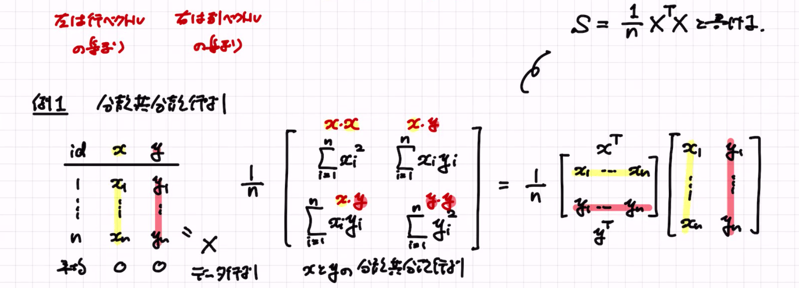

## 1回目

-   相関係数

    -   相関係数の取りうる値の範囲の証明2パターン

        -   二次方程式の判別式を用いた証明

            -   二次不等式を考える。

            -   $\sum_i^n(tX_i-Y_i)^2≥0$

        -   データをベクトルとみなして、cosθと捉え直す方法

## 2回目

##  

## 3回目

-   行列の掛け算

    -   パターン1：左の行列を「列ベクトルの集まり」、右の行列を「その重み」とみる。

        -   左を2×2行列、右を2×1の行列（ベクトル）とする。

        -   そうすると、重み付き和として捉えられる。

        -   掛け算と思うから気持ち悪いが、線形和（一次結合）を行列では掛け算と呼んでいる、と捉えると分かる。

        -   例：線形回帰分析

            -   $y_1=\beta_0+\beta_1x_1$

            -   $y_2=\beta_0+\beta_1x_2$

            -   すなわち、$Y=X\beta$

    -   パターン2：内積の集まり

        -   左は行ベクトルの集まり

        -   右は列ベクトルの集まり

{width="602"}

-   線形回帰モデルの最小二乗法

定理

-   $\beta$の最小二乗推定量は、$X^TX\beta=X^Ty$ の解である。

-   yを1ベクトルとベクトルXが張る平面Mに垂直に降ろしてできるベクトル$\hat y$

-   主成分分析

    -   $z_i=w_1x_{i1}+...+w_dx_{id}$ i行目の線形和

    -   このとき$z_1,...,z_n$ の分散を最大にするような$w_1,..,w_d$ を最大にするような$z_i$ を第1主成分という。